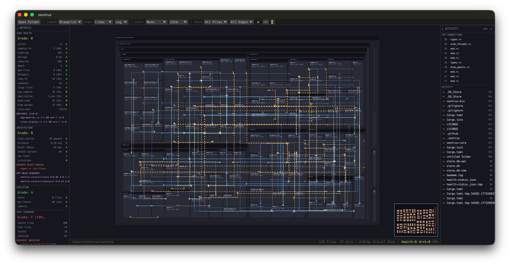

# sentrux

Live codebase visualization and structural quality analysis. See your architecture as a treemap with dependency edges, health grades, and real-time file watching.



## What it does

- **Treemap + Blueprint layouts** — files sized by lines of code, colored by language/heat/complexity
- **Dependency edge routing** — import, call, and inheritance edges drawn as animated polylines
- **14 health metrics** — coupling, cycles, cohesion, entropy, complexity, duplication, dead code, and more (A-F grades)
- **4 architecture metrics** — levelization, blast radius, attack surface, distance from main sequence
- **Evolution analysis** — git churn, bus factor, temporal hotspots, change coupling
- **DSM (Design Structure Matrix)** — NxN dependency matrix with cluster detection
- **Test gap analysis** — find high-risk untested files
- **Rules engine** — define architectural constraints in `.sentrux/rules.toml`
- **MCP server** — 15 tools for AI agent integration (Claude Code, Cursor, etc.)
- **Real-time file watcher** — incremental rescan when files change

## Install

```bash
curl -fsSL https://raw.githubusercontent.com/sentrux/sentrux/main/install.sh | sh
```

### From source

```bash
git clone https://github.com/sentrux/sentrux.git
cd sentrux
cargo build --release
# Binary at target/release/sentrux
```

Or download binaries directly from [Releases](https://github.com/sentrux/sentrux/releases).

## Quick start

```bash
# GUI mode — open the visual treemap
sentrux

# CLI — check architectural rules
sentrux check /path/to/project

# CLI — structural regression gate
sentrux gate --save /path/to/project   # save baseline
sentrux gate /path/to/project          # compare against baseline
```

## MCP server (AI agent integration)

Run as a Model Context Protocol server for Claude Code, Cursor, or any MCP-compatible AI agent:

```bash
sentrux --mcp
```

Add to your `.mcp.json`:

```json
{
  "sentrux": {
    "command": "sentrux",
    "args": ["--mcp"]
  }
}
```

Available tools: `scan`, `health`, `architecture`, `coupling`, `cycles`, `hottest`, `evolution`, `dsm`, `test_gaps`, `check_rules`, `session_start`, `session_end`, `rescan`, `blast_radius`, `level`.

## Rules

Create `.sentrux/rules.toml` in your project root:

```toml
[constraints]
max_cycles = 0
max_coupling = "B"
max_cc = 25
no_god_files = true

[[layers]]
name = "core"
paths = ["src/core/*"]
order = 0

[[layers]]
name = "app"
paths = ["src/app/*"]
order = 2
```

Then run `sentrux check` to enforce.

## Architecture

```
sentrux/
  sentrux-core/    # library crate — analysis engine, metrics, MCP server
  sentrux-bin/     # binary crate — GUI, CLI, MCP entry points
```

## License

MIT
