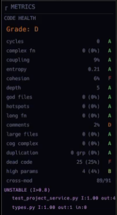
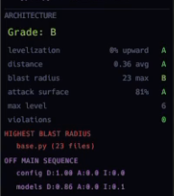
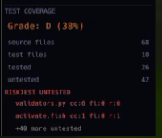

<div align="center">

<picture>
  <source media="(prefers-color-scheme: dark)" srcset="assets/logo-dark.svg">
  <source media="(prefers-color-scheme: light)" srcset="assets/logo-light.svg">
  
</picture>

<br><br>

**See your codebase. Govern your AI agents.**

Live architecture visualization + structural quality gate for AI-agent-written code.

Pure Rust. Single binary. 23 languages. No runtime dependencies.

[](https://github.com/sentrux/sentrux/actions/workflows/ci.yml)
[](https://github.com/sentrux/sentrux/releases)
[](LICENSE)
[](https://github.com/sentrux/sentrux/stargazers)

</div>

<div align="center">


<sub>**Demo:** Claude Code builds a FastAPI task management API from a single prompt. sentrux visualizes the architecture growing in real-time — files appear, dependency edges form, health grades update live. **Final result: Health Grade D.** Even with careful prompting, AI agents accumulate structural debt without a quality gate.</sub>

</div>

<details>
<summary>See the final grade report of this demo project</summary>
<br>
<table>
<tr>
<td align="center"><br><b>Health: D</b><br><sub>cohesion F, dead code F (25%)<br>comments D (2%)</sub></td>
<td align="center"><br><b>Architecture: B</b><br><sub>levelization A, distance A<br>blast radius B (23 files)</sub></td>
<td align="center"><br><b>Test Coverage: D</b><br><sub>38% coverage<br>42 untested files</sub></td>
</tr>
</table>
</details>

## Why

**Ever noticed your AI agent getting "dumber" as your project grows?**

You start a project with Claude Code or Cursor. The first few sessions are magic — the agent writes clean code, understands your intent, implements features fast. Then around week two, something shifts. The agent starts hallucinating functions that don't exist. It puts new code in the wrong place. It introduces bugs in files it worked on yesterday. You ask for a simple change and it breaks three other things.

**It's not the AI losing capability. It's your codebase losing structure.**

As AI agents generate code, the architecture silently decays. Same function names serve different purposes across files. Unrelated code piles into the same folder. Dependencies tangle into spaghetti. When the agent searches your project, dozens of conflicting results come back — and it picks the wrong one. Every session makes the mess worse. Every mess makes the next session harder.

You've seen this. You just didn't have a way to measure it.

The conventional answer is *"plan your architecture first, then let AI implement."* But that's not how anyone actually works with AI agents. We prototype fast, iterate through conversation, let inspiration guide development. This naturally produces messy structure — and AI agents fundamentally cannot focus on the big picture and small details at the same time.

**sentrux makes the invisible visible.** It watches your codebase in real-time as the agent writes code, grades structural quality across 14 dimensions (A-F), and shows you exactly when and where architecture degrades — so you catch the rot before it compounds.

The demo above tells the whole story: a single prompt, a capable AI agent, careful instructions — and the result is still **Health Grade D**. Without structural governance, every AI-generated codebase trends toward unmaintainability. sentrux is the feedback loop that prevents it.

## Install

```bash
brew install sentrux/tap/sentrux
```

Or quick install on macOS / Linux:

```bash
curl -fsSL https://raw.githubusercontent.com/sentrux/sentrux/main/install.sh | sh
```

<details>
<summary>More install options</summary>

**From source:**

```bash
git clone https://github.com/sentrux/sentrux.git
cd sentrux
cargo build --release
# Binary at target/release/sentrux
```

**Download binaries** from [Releases](https://github.com/sentrux/sentrux/releases).

**Upgrade:**

```bash
# Homebrew
brew update && brew upgrade sentrux

# Quick install (re-run — always pulls latest)
curl -fsSL https://raw.githubusercontent.com/sentrux/sentrux/main/install.sh | sh

# From source
git pull && cargo build --release
```

</details>

## Quick start

```bash
# Open the GUI — visual treemap of your project
sentrux

# Check architectural rules (CI-friendly, exits 0 or 1)
sentrux check /path/to/project

# Structural regression gate
sentrux gate --save .   # save baseline before agent session
sentrux gate .          # compare after — catches degradation
```

## What it does

**Visualize** — live interactive map of your entire codebase
- Treemap + Blueprint DAG layouts — files sized by lines, colored by language/heat/complexity
- Dependency edges — import, call, and inheritance as animated polylines
- Real-time file watcher — files glow when modified, incremental rescan

**Measure** — 14 health dimensions, graded A-F
- Coupling, cycles, cohesion, entropy, complexity, duplication, dead code
- Architecture metrics — levelization, blast radius, attack surface, distance from main sequence
- Evolution analysis — git churn, bus factor, temporal hotspots
- DSM (Design Structure Matrix) + test gap analysis

**Govern** — catch structural regression automatically
- Rules engine — define constraints in `.sentrux/rules.toml`
- Baseline gate — `sentrux gate` blocks degradation before it ships
- MCP server — 15 tools for AI agent integration (Claude Code, Cursor, etc.)

## MCP server (AI agent integration)

sentrux runs as an [MCP](https://modelcontextprotocol.io) server, giving AI agents real-time access to structural health.

Add to your `.mcp.json`:

```json
{
  "sentrux": {
    "command": "sentrux",
    "args": ["--mcp"]
  }
}
```

<details>
<summary>Example: agent checks health after writing code</summary>

```
Agent: scan("/Users/me/myproject")
  → { structure_grade: "B", architecture_grade: "B", files: 139 }

Agent: health()
  → { grade: "B", dimensions: { coupling: "A", cycles: "A", cohesion: "C", ... } }

Agent: session_start()
  → { status: "Baseline saved", grade: "B" }

  ... agent writes 500 lines of code ...

Agent: session_end()
  → { pass: false, grade_before: "B", grade_after: "C",
      summary: "Architecture degraded during this session" }
```

15 tools: `scan`, `health`, `architecture`, `coupling`, `cycles`, `hottest`, `evolution`, `dsm`, `test_gaps`, `check_rules`, `session_start`, `session_end`, `rescan`, `blast_radius`, `level`.

</details>

<details>
<summary>Rules engine — define architectural constraints</summary>

`.sentrux/rules.toml`:

```toml
[constraints]
max_cycles = 0
max_coupling = "B"
max_cc = 25
no_god_files = true

[[layers]]
name = "core"
paths = ["src/core/*"]
order = 0

[[layers]]
name = "app"
paths = ["src/app/*"]
order = 2

[[boundaries]]
from = "src/app/*"
to = "src/core/internal/*"
reason = "App must not depend on core internals"
```

```bash
sentrux check .
# sentrux check — 4 rules checked
# Structure grade: B  Architecture grade: B
# ✓ All rules pass
```

</details>

## Supported languages

Rust, Python, JavaScript, TypeScript, Go, C, C++, Java, Ruby, C#, PHP, Bash, HTML, CSS, SCSS, Swift, Lua, Scala, Elixir, Haskell, Zig, R, OCaml — 23 languages via tree-sitter.

## License

[MIT](LICENSE)
